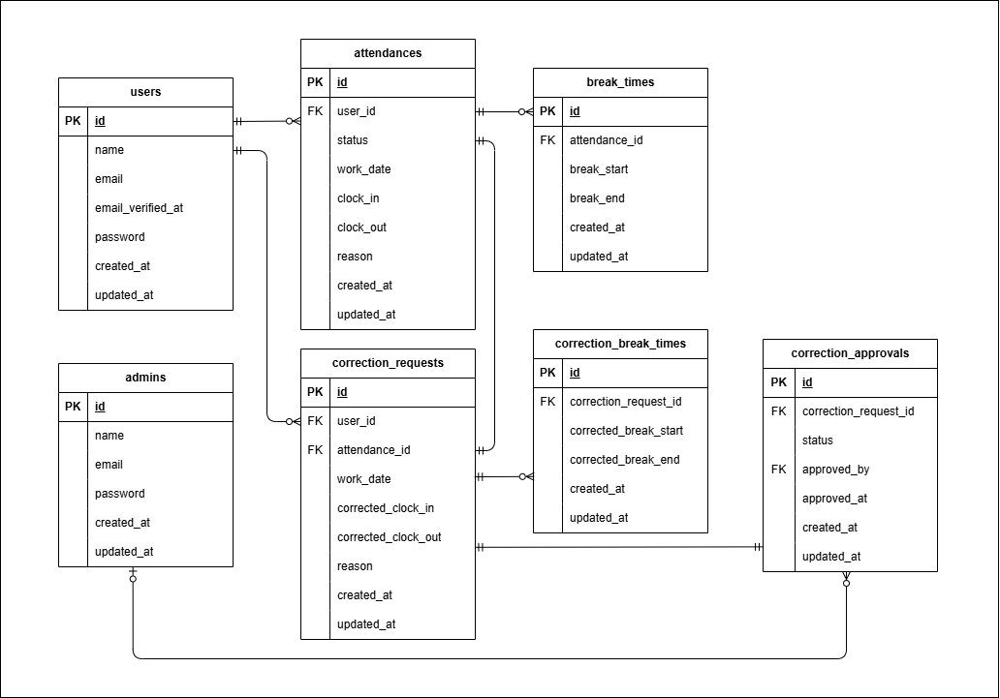

# 勤怠アプリ
サービス名:coachtech 勤怠管理アプリ  
サービス概要:ある企業が開発した独自の勤怠管理アプリ

## 環境構築
- Docker のビルド
1. git clone git@github.com:murata-am/attendance.git  
  attendanceへ移動する
2. docker-compose up -d --build  
- Laravel 環境構築  
3. docker-compose exec php bash  
4. composer install  
5. cp .env.example .env  
   .envファイルの以下の環境変数を変更する

```bash
 DB_CONNECTION=mysql　　
 DB_HOST=mysql　　
 DB_PORT=3306　　
 DB_DATABASE=laravel_db　　
 DB_USERNAME=laravel_user　　
 DB_PASSWORD=laravel_pass
```
 ※環境構築の際、権限エラーが出ることがありましたので、次のコマンドなどで
 読み取り可能にできるものをお願いします。
 ```bash
 sudo chmod -R 664 src/*
```

6. アプリケーションキーの作成
   php artisan key:generate
7. マイグレーションの実行
   php artisan migrate
8. シーディングの実行
   php artisan db:seed

## 使用技術（実行環境）
- Laravel 8.83.29
- PHP 7.4.9
- SQL 8.0.26

## ER図


## メール認証

mailtrapというツールを使用しています。  
以下のリンクから会員登録をしてください。  
https://mailtrap.io/

メールボックスのIntegrationsから 「laravel 7.x and 8.x」を選択して  
.envファイルのMAIL_MAILERからMAIL_ENCRYPTIONまでの項目をコピー＆ペーストしてください。  
加えてペーストしたPasswordが***で隠れている場合は、CredentialsにあるPasswordをコピーして貼り付けなおしてください。   
MAIL_FROM_ADDRESSは任意のメールアドレスを入力してください。  
.envファイルにコピー＆ペーストした後は、以下を実行してください。
```bash
php artisan config:clear
```

## テストアカウント
### 管理者ユーザー
名前：管理者ユーザー  
メールアドレス：admin@example.com  
パスワード：password123

名前：管理者ユーザー2  
メールアドレス：admin2@example.com  
パスワード：password123

### 一般ユーザー
名前：テスト太郎  
メールアドレス：test1@example.com  
パスワード：password  

名前：テスト次郎  
メールアドレス：test2@example.com  
パスワード：password

名前：テスト三郎  
メールアドレス：test3@example.com  
パスワード：password

## URL
- 開発環境：http://localhost/
- 一般ユーザーログイン画面：http://localhost/login
- 管理者ユーザーログイン画面：http://localhost/admin/login
- phpMyAdmin：http://localhost:8080
